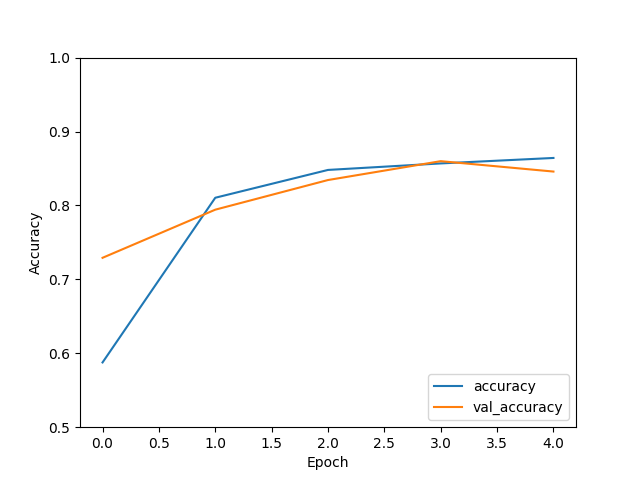
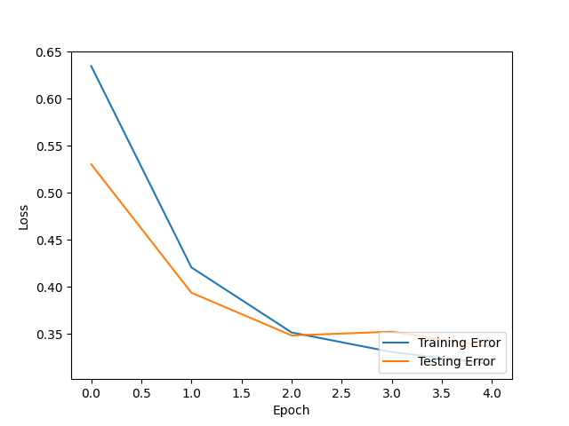

# Recurrent Neural Networks Labs

The objective of this lab is to give you hands-on experience designing a recurrent neural network (RNN).
These instructions will provide you with a basic RNN architecture for text classification, and
provide you with default training settings. This sample model has a mediocre performance. Your
job is to use your knowledge about model capacity, under/over fitting, and deep network
architectures to improve the performance, i.e., reduce the testing error.   

## Setup your development environment
The code for this lab is in Python and uses the TensorFlow library. These instructions will teach you how
to edit and run the code in VS-Code, a commonly used coding editor with debugger, on your computer. 
You may use any editor and debugger that you like (e.g., Juptyer notebooks, Google Colab, Kagle, etc).
However, the instructions will assume you are using vs-code, and the instructor will be unable to provide
help for different editors. 

### Install Python 
[Download](https://www.python.org/downloads/) Python and follow the installation instructions for your OS

### Install VS-Code
[Download](https://code.visualstudio.com/Download) VS-Code and follow the installation instructions for your OS.

### Install the Python Extension in VS-Code
1. Open VS-Code 
2. Click on the Extension Icon or use the command `Ctrl+Shift+X`
3. Type "python" in the search box
4. Click on the extension called `Python` published by Microsoft
5. Click Install

### Additional Resources
If you need more details on how to install Python and the Python extension, please read this
[guide](https://code.visualstudio.com/docs/python/python-tutorial)

## Getting the code 
After you have installed Python and the Python extension, download the code, save it to a new
folder, and then open the folder in VS-Code.

1. Click on the green button with the `Code` label on the top right of this page.
2. Click on `Download Zip`

Alternatively, you can use the `git` program to clone the directory to your computer. 
You can also copy and paste manually from the individual files. 

### Open the folder in VS-Code
1. Open VS-code
2. Click on the Explorer icon or press `Ctrl+Shift+E`
3. Click on `Open Folder`
4. Select and open the `rnn-lab` folder. 
5. You should see the lab files displayed on the file explorer column. 

## Code test drive
Before we start tinkering with the code, let's take a look at the various files, understand
what they do, and make sure they work.  

### The `encoder-embedding-exploration.py` file
Unlike image classification problems where we can directly use our data to train our models, text
classification problems require us to first pre-process the data. The main reason is that deep learning
models are unable to take the characters in the text as input. To solve this issue, we first look at all
the words that appear in our training data set and form a list of unique words. We call this list the
vocabulary. We then assign a unique number to each word in the vocabulary. We call this number the
tokens. The idea of the encoder is to substitute the words in the sample with their respective tokens
within our RNN. 

You may be tempted to stop at the encoder. However, our vocabulary has many words that have identical
meaning (i.e., synonyms) or similar meanings (i.e., near synonyms.). Since we are doing text
classification, we want our RNN to be able to learn the meaning of the words rather than the
words themselves. To this end, we use a technique called embedding. Embedding replaces the tokens with
vectors that represent the meaning of the words. Words with similar meaning will have similar vectors. 

To run the file, 
1. Open the `encoder-embedding-exploration.py` file. 
2. *Read the comments and code* 
3. Press `Ctrl+Shift+D` to open the debug icon and then click `Run and debug`.
4. Alternatively, you can press `Ctrl+F5` to directly run the file.   

You should see a few words from the vocabulary as well as an example of how a movie review was tokenized
by the encoder.  

### The `build-rnn.py` file
This file builds an RNN model and saves it to a file. This is an important file as all the
design choices about the architecture of the model and its training are coded here.

Let's run the file and see the model that it creates. 
1. Run the file by pressing `Ctrl+F5`
2. Open the image file with the name specified in line 69

#### Questions
1. Describe the architecture of the RNN. Provide details about the layers' size, type, and
   number. Also provide details about the activation functions used.

**Answer**. The model is formed by 6 layers, 

*Layer 1*. This is the input layer. The size of the input is `(None,)`. None indicates that
the number of samples to be processed in batch is variable (i.e, the batch size). The empty
field next to none indicates that the size of the inputs (i.e.,  the reviews) are also
variable. 

*Layer 2*. The TextVectoriztion layer comes next. The input and ouputs of this layer are also variable
since it only replaces words with tokens. 

*Layer 3*. The Embedding layer also has a variable input. The output yields a variable number of vectors
of size 64. 

*Layer 4*. The bidrectional LSTM layer outputs a vector of size 128. 

*Layer 5*. This dense layer outputs a vector of size 64. 

*Layer 6*. This dense layer finally condenses the model into a scalar output. 

2. Build a two-column table. The first row should have the lines of code that define the layers. The
   second column should have a screen shot of the corresponding layer in the architecture figure.

*Layer 1* this layer is atuanatically created by TensorFlow. 
*Layer 2* this layer is given by `encoder = tf.keras.layers.TextVectorization(max_tokens=VOCAB_SIZE)`
*Layer 3* this layer is defined by 
`model.add(tf.keras.layers.Embedding(input_dim=len(encoder.get_vocabulary()), output_dim=64, mask_zero=True))`
*Layer 4* is defined by `model.add(tf.keras.layers.Bidirectional(tf.keras.layers.LSTM(64)))`
*Layer 5* is defined by `model.add(tf.keras.layers.Bidirectional(tf.keras.layers.LSTM(64)))` 
*Layer 6* is defibed by `model.add(tf.keras.layers.Dense(1))`

3. Draw the input and output tensors and label its sizes for each layer. 

**Answer** You should be able to draw them based on the previous answers.

### The `training-rnn.py` file
Now that we have defined the architecture of the model, we are ready to train it. The training
algorithm and parameter choices are coded in this file. The file also runs trains the model and
then saves it to a file. 

Lets run the file to train the model. 
1. Press `Ctrl+F5`

#### Questions
1. Which variables in the code are used as the training dataset by the function `fit`?

**Answer**. `train_dataset`

2. Which variables in the code are used as the testing dataset by the function `fit`?
**Answer**. `test_dataset`

3. Is accuracy a good performance measure? Why?
**Answer** Since we are dealing with a binary classification problem, i.e., the review is
*either positive or negative, and we have a balanced dataset, accuracy is a good measure. 

4. Is binary cross-entropy the appropriate loss function?  Why not use categorical cross-entropy?
We use binary cross-entropy because our labels are either 1 or 0.  

### The `analysis.py` file
Now that we have a trained model, we can observe the training error, testing error, and accuracy. 

Run the file to generate the plots
1. Press `Ctrl+F5`
2. Open the accuracy plot (file name specified in line 22)
3. Open the loss plot (file name in line 35)

#### Questions
3. We are using the binary cross-entropy (CCE) to measure the loss. 
   Would a larger CCE or smaller CCE result in a lower testing error?

   **Answer**. A larger CCE results in a larger testing error. 

4. What is the accuracy of the model?

   **Answer** The accuracy indicates the percentage of correctly classified texts. 

5. Has the training/testing accuracy converged in the accuracy plot?

**Answer** We cannot tell since we only trained for one epoch. 

6. Has the training/testing loss converged  in the loss plot?

**Answer** We cannot tell since we only trained for one epoch. 

7. Did the difference between the training and testing loss/accuracy decreased or     
   increased across epochs? If it increased and decreased in the plot specify in which
   epochs it increased/decreased? 

**Answer** We cannot tell since we only trained for one epoch.

8. Give the potential reasons that can explain the low accuracy of the model (anything 
   below 90% is considered low)

**Answer** We have 0.52 accuracy. This is low. Probably because we only trained for one epoch. 

## Updating the code to improve performance. 
Now that you have a trained model, lets see if we can improve it. We can change the training
parameters and the model itself. 

### Updating the Training Parameters
1. Based on your answers to Q.5 in the `analysis.py` file [section](#the-analysispy-file), 
   make changes to the training parameters to improve the testing accuracy and loss. 
2. Describe your changes. 

**Answer** Lets start with training the model with more epochs. One epoch is not enough to evaluate if
the model is under or overfitting. I changed the number of epochs from 1 to 5 and obtained the following
plots. 

We see that the testing accuracy starts to decrease at the last epoch. This suggests that the model is
starting to overfit. However, we would need to run additional epochs to ensure this is not just a
temporary decrease and future epochs can improve the accuracy. Recall that the loss function is
non-linear and perhaps we landed on a local minimum. Similarly, the loss function starts to increase
during the last two epochs. 

Besides increasing the number of epochs, we can use additional convolutional layers after the
bidirectional layer. We can also add an additional bidirectional or regular LSTM layer. The first dense
layer can be replaced by a convolutional layer. 

3. Run the `training.py` and `analysis.py` files with your new parameters. 
4. Did the testing performance improve? Explain why or why not. 

**Answer** The testing performance increased after increasing the number of epochs. We can achieve an
accuracy lose to 90 percent, which is good. 

### RNN Model updates
1. Based on your answers to Q.5 in the `analysis.py` file [section](#the-analysispy-file), make changes
   to the RNN architecture. E.g., add or remove layers, change the activation function, etc.  
2. Describe your changes. 
3. Run the `training.py` and `analysis.py` files with your new parameters. 
4. Did the testing performance improve? Explain why or why not. 
**See answers above**